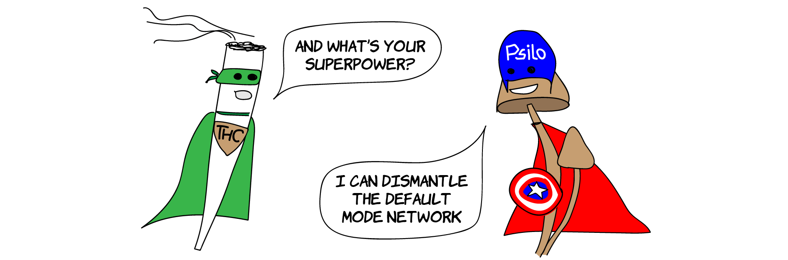

**[Medical Benefits of Psychedelic Drugs]()**\\
Ecstasy, LSD, magic mushrooms and ketamine were found to be extraordinarily effective in treating mental illnesses such as depression, anxiety or PTSD. An overview.

**[Psychedelic Drugs and the Serotonergic System]()**\\
The neurotransmitter serotonin is key to understanding how antidepressants and psychedelic drugs work. Check out the infographics to learn how the serotonergic system functions and how drugs like SSRIs, MDMA and LSD interact with it.

**[The Psychedelic Experience]()**\\
How does it feel taking MDMA, LSD, psilocybin or ketamine? A quantitative model of altered states of consciousness compares the unique signature effects of each drug.

**[Your Brain on Psychedelic Drugs]()**\\
What is it about psychedelics that has the power to change lives for the better? The answer might lie in the unique ways that psychedelics interact with the brain.

**[Psychedelics and Mental Health]()**\\
Psychedelic drugs appear to be extraordinarily effective in treating mental disorders: latest research results show immediate and long-lasting effects in mood disorders and addiction.

**[Microdosing LSD: Smart Drug or Placebo?]()**\\
Microdosing LSD promises to act like a mix of Adderall and Prozac but without the side effects. Sounds too good to be true; is it? Here is an overview of what scientific proof we have as of today.

**[MDMA-assisted Therapy]()**\\
MDMA-assisted therapy for PTSD has shown to be far more effective that any other PTSD treatment currently available. Beyond healing trauma, researchers see possible applications in couples therapy, social anxiety and end-of-life distress.
